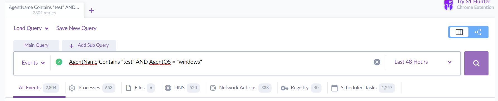
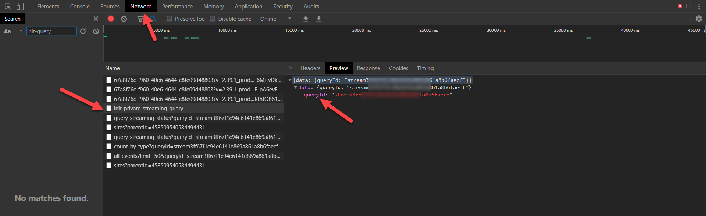
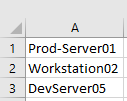
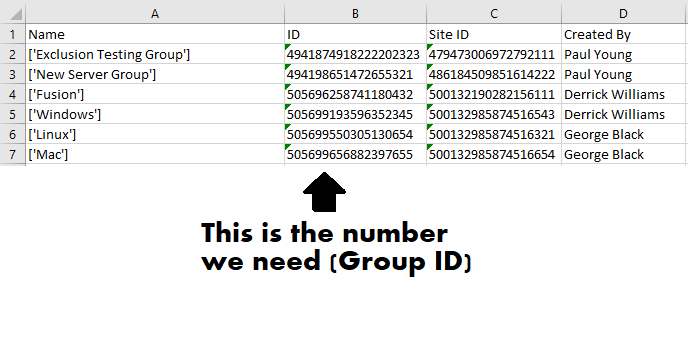
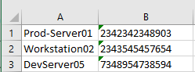
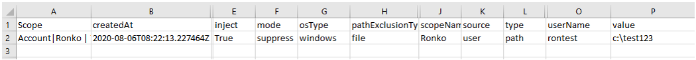

<div id="top"></div>

<h1 align="center">S1 Manager</h1>

<div align="center">

![S1 Manager][product-screenshot]

</div>

The S1 Manager tool is a GUI-based application to assist SentinelOne administrators in performing specific tasks via the v2.1 API. The tool was developed in Python 3 with TKinter.

> This tool requires a SentinelOne Management Console and an API Token for a user with appropriate permissions to run the various API calls. Use of this tool assumes the user has an active license to use the SentinelOne product.

<div align="center">

[Report Bug or Request Feature][issues-url]

</div>

<br />

<!-- GETTING STARTED -->
## Getting Started

### Download EXE
[https://github.com/DylanCS1/s1_manager/blob/main/dist/s1_manager.exe](https://github.com/DylanCS1/s1_manager/blob/main/dist/s1_manager.exe)


### Run from source
To get a local copy up and running follow these simple steps:
1. Clone the repo
   ```sh
   git clone https://github.com/DylanCS1/s1_manager.git
   ```
2. Install Python package dependencies
   ```sh
   pip install install -r requirements.txt
   ```
3. Run the s1_manager.py
   ```sh
   python3 s1_manager.py
   ```


### Build EXE
1. Clone the repo
   ```sh
   git clone https://github.com/DylanCS1/s1_manager.git
   ```
2. Install Python package dependencies
   ```sh
   pip install install -r requirements.txt
   ```
3. Build EXE with pyinstaller
   ```python
   pyinstaller --hidden-import babel.numbers --onefile --noconsole s1_manager.py
   ```

<p align="right">(<a href="#top">back to top</a>)</p>


<!-- USAGE EXAMPLES -->
## Usage

On the current release, everything runs on a single thread so when executing a task the GUI will appear to be "dead" (GUI cannot accept new events). You will just need to be patient :)  

The permissions assigned to the user associated with the API Token define what actions can be performed, and at what scope.

### Login:

1. Input your SentinelOne Management Console address (e.g., https://abc-corp.sentinelone.net)
2. Input your user account API Token
3. Add proxy address details (if needed) 
4. If using an On-Prem console with a self-signed certificate you will need to uncheck the **Use SSL** option
5. Click *Submit*


### Export Deep Visibility Events

Export events from Deep Visibility to a CSV based on a Deep Visibility Query ID.

To generate a Deep Visibility query:
1. Log in to the Management Console
2. Go to the Deep Visibility Page and create the query. For example: *AgentName Contains "test" AND AgentOS = "windows"*
 


3. Open your web browser's Developer Tools (```F12 or CTRL+SHIFT+i```)
4. Open the Network tab 
5. Run the query in the Management Console
6. Click on init-query and copy your queryID




### Search and Export Activity Log

Search and export the activity log.
> Search is not Case Sensitive


### Upgrade Agents from CSV

Bulk upgrade agents from a named endpoint list in a CSV file.

Requirements:
- A CSV file containing a single column of Endpoint names to be upgraded
- All endpoints should have unique names to avoid affecting duplicate entries
> Refer to the SentinelOne KB on [Creating Filters for Endpoints](https://support.sentinelone.com/hc/en-us/articles/360004221853-Creating-Filters-for-Endpoints-Multi-Site-) for more information.

Process:
1. Export the Packages List and get the relevant Package ID
> If you are using Microsoft Excel, make sure the ID cell is formatted as Text when imported, otherwise, some of the digits might be changed to zeros
> [https://support.microsoft.com/en-us/help/269370/last-digits-are-changed-to-zeroes-when-you-type-long-numbers-in-cells](https://support.microsoft.com/en-us/help/269370/last-digits-are-changed-to-zeroes-when-you-type-long-numbers-in-cells)
2. Insert the package ID
3. Select a CSV containing a single column of endpoint names to be upgraded. For example:




### Move Agents from CSV

Move the agents listed in the CSV to the target site ID and target group ID.
> If the target group is dynamic the agent will only be moved into the parent site scope.

Requirements:
- A CSV file containing the Endpoint names to be moved
> There should be no column headers and the columns should consist of endpoint name, target group ID, and target site ID
- All endpoints should have unique names to avoid affecting duplicate entries
> Refer to the SentinelOne KB on [Creating Filters for Endpoints](https://support.sentinelone.com/hc/en-us/articles/360004221853-Creating-Filters-for-Endpoints-Multi-Site-) for more information.


Process:
1. Export groups list to get the relevant Group ID 
> Please see the note above if using Microsoft Excel

2. Create a CSV file containing three columns without headers



### Assign Customer Identifier from CSV

Easily add a Customer Identifier to Agents from a source CSV of endpoint names.

Requirements:
- A named list of endpoints who share a similar logical trait (i.e they are all Dev Servers)
> Refer to the SentinelOne KB on [Creating a User Defined Endpoint ID](https://support.sentinelone.com/hc/en-us/articles/360038970994-Creating-a-User-Defined-Endpoint-ID)


Process:
1. Insert the Customer Identifier
2. Select a CSV containing endpoint names
> If you have duplicate names, all the endpoints with this name will be assigned the same customer identifier


### Decomission Agents from CSV

Decommission SentinelOne agents in bulk using a source CSV of endponit names.

Requirements:
- A CSV containing the list of endpoints that need to be decomissioned
> Refer to the SentinelOne KB on [Removing an Agent from the Console](https://support.sentinelone.com/hc/en-us/articles/360004242793-Removing-an-Agent-from-the-Console-Decommission-Multi-Site-)

Process:
1. Select a CSV containing endpoint names to be decomissioned
> If you have duplicate names, all the endpoints with this name will be decomissioned.


### Export all Agents to CSV

Export the list of Agents in the SentinelOne console.
> Management consoles prior to the Rio SP1 release have a lower limit on the number of Agents that can be exported to CSV.


### Export Exclusions to CSV

Export all exclusions from the Account scope.



<p align="right">(<a href="#top">back to top</a>)</p>


<!-- ROADMAP -->
## Roadmap

- [ ] Add additional features around newer API offerings
- [ ] Update dependencies
- [ ] UI Enhancements
    - [ ] Uniformity between panes, buttons, font, etc.
    - [ ] Improve color theme
- [ ] Implement code styling restraints
- [ ] Refactor/cleanup code

<p align="right">(<a href="#top">back to top</a>)</p>


<!-- CONTRIBUTING -->
## Contributing

Contributions are greatly appreciated.

If you have a suggestion that would make this better, please fork the repo and create a pull request. You can also simply open an issue with the tag "enhancement".
Don't forget to give the project a star if you found it useful! Thanks again!

1. Fork the Project
2. Create your Feature Branch (`git checkout -b feature/NewFeature`)
3. Commit your Changes (`git commit -m 'Add some NewFeature'`)
4. Push to the Branch (`git push origin feature/NewFeature`)
5. Open a Pull Request

<p align="right">(<a href="#top">back to top</a>)</p>


<!-- LICENSE -->
## License

Distributed under the MIT License. See [LICENSE.txt][license-url] for more information.

SentinelOne and the SentinelOne logomark are &trade; of [SentinelOne](https://www.sentinelone.com/legal/tm-guidelines/ "SentinelOne Trademark").

<p align="right">(<a href="#top">back to top</a>)</p>


<!-- ACKNOWLEDGEMENTS -->
## Acknowledgements

A huge thank you to the following individuals for starting the S1 Manager tool project:
- [guysentinel](https://github.com/guysentinel "guysentinel")
- [tomerbsentinel](https://github.com/tomerbsentinel "tomerbsentinel")
- [RokoS1](https://github.com/RokoS1 "RokoS1")

[Click to see all Contributors][contributors-url]

And to the following resources:
- [SentinelOne](https://www.sentinelone.com/ "SentinelOne")
- [Python](https://www.python.org/downloads/ "Python Download")
- [Requests](https://docs.python-requests.org/en/latest/ "Python Requests library")
- [Babel](https://babel.pocoo.org/en/latest/index.html "Python Babel library")
- [Othneildrew](https://github.com/othneildrew) for the README.md template.  

<p align="right">(<a href="#top">back to top</a>)</p>


<!-- MARKDOWN LINKS & IMAGES -->
<!-- https://www.markdownguide.org/basic-syntax/#reference-style-links -->

[contributors-url]: https://github.com/DylanCS1/s1_manager/graphs/contributors "Contributors"
[issues-url]: https://github.com/DylanCS1/s1_manager/issues "Issues"
[license-url]: https://github.com/DylanCS1/s1_manager/blob/main/LICENSE.txt "MIT License"
[product-screenshot]: dist/s1_manager/tk/images/image_5.png "S1 Manager Screenshot"
